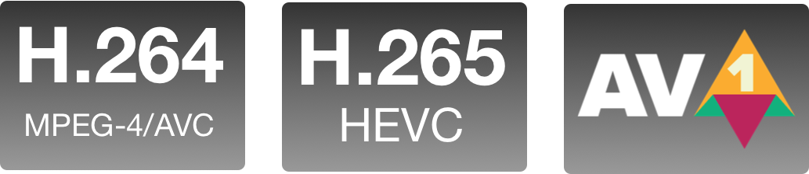

# Video Comparison Player
<a href="https://github.com/bergkamp/video-comparison-player/releases/latest"> </a>
<a href="https://github.com/bergkamp/video-comparison-player/blob/main/LICENSE"></a>




EN|[中文](README-ZH.md)

Video Comparison Player is a desktop tool for video super-resolution developers. 

Download the latest version of Mac and Windows [here](https://github.com/bergkamp/video-comparison-player/releases/latest)


Main features:
* Support Windows and Mac（M1 & Intel）
* Support two videos or pictures to be played synchronously on the left and right sides
* Support synchronous playback progress
* Support dark mode
* Support shortcut keys
  * `Left and right key` control dividing line
  * `Up key` to control the direction key to return to center
  * `Space` control playback pause
* Support H.264|HEVC|AV1 codecs

## Environment Settings
node & npm https://nodejs.org/en/download/

V1.0.0 node v16.15.0 npm 8.5.5

V0.5.0 node v14.16.0 npm 6.14.11

## Set up
### Settings
```bash
npm install
```
### Development
```bash
npm run dev
```
### Package
```bash
npm run build
```
